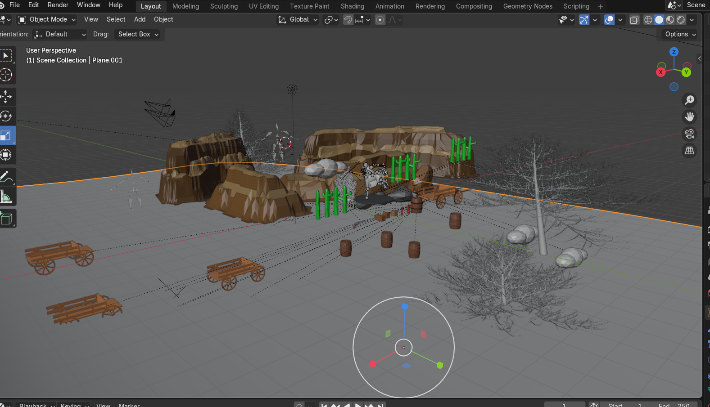
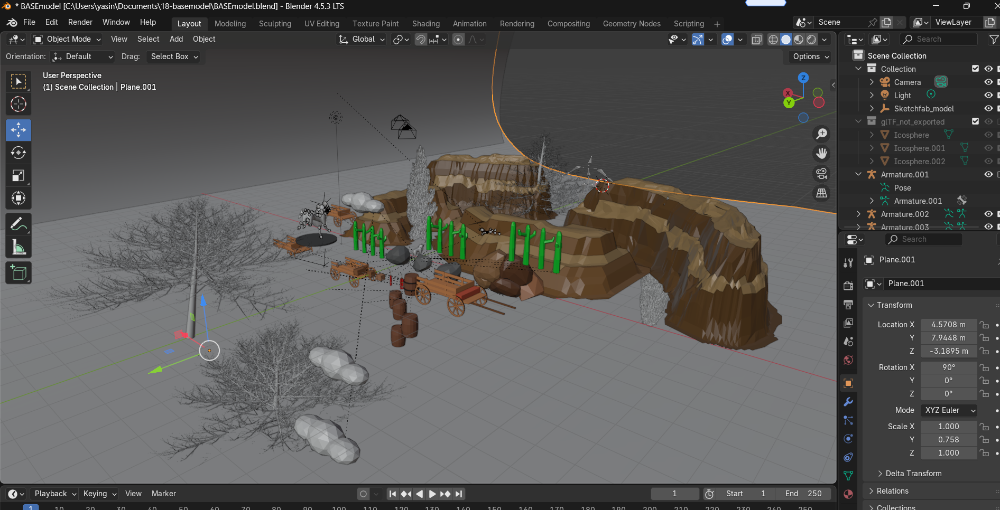

# 🌍 Lowpoly World – Three.js + Blender Project

This project was created as part of the ** Low Poly World** assignment.  
It demonstrates a simple 3D environment built in **Blender**, exported as a `.glb` model,  
and rendered in the browser using **Three.js** with a working environment map.

---

## 🧩 Features

- ✅ GLTF/GLB model loaded with **Three.js GLTFLoader**
- ✅ Landscape sculpted and textured in **Blender**
- ✅ Metric scale and real-time rendering
- ✅ Basic lighting and **OrbitControls**
- ✅ Environment map reflections (optional)
- ✅ Deployed online for live viewing

---

## 🚀 Live Demo

🔗 **Running App:**  
[https://my-lowpoly-world.vercel.app](https://my-lowpoly-world.vercel.app)

🔗 **GitHub Repository:**  
[https://github.com/yasinSahyar/Blender](https://github.com/yasinSahyar/Blender)

---

## 🧠 How It Was Made

1. **Modeling:**  
   Created a low poly landscape in Blender using sculpting tools.  
   Added trees, rocks, and water using online low-poly assets (Sketchfab, PolyHaven, Free3D).  

2. **Texturing:**  
   Used texture paint to give terrain basic color variation.  
   Applied materials to ground and water.  

3. **Exporting:**  
   Exported as `.glb` with **Draco compression** enabled for smaller file size.  

4. **Rendering:**  
   Loaded the model with `GLTFLoader` in Three.js and added simple lighting.  
   Added `OrbitControls` to explore the scene.  

5. **Deployment:**  
   Hosted using **Vite + Vercel** for a live online version.

---

## 🖼️ Screenshot

Below is an image of the 3D world as rendered in the browser:

> 

---

## ⚙️ Technologies Used

- [Blender](https://www.blender.org/)
- [Three.js](https://threejs.org/)
- [Vite](https://vitejs.dev/)
- [JavaScript (ES6)](https://developer.mozilla.org/en-US/docs/Web/JavaScript)
- [Vercel Deployment](https://vercel.com/)

---

